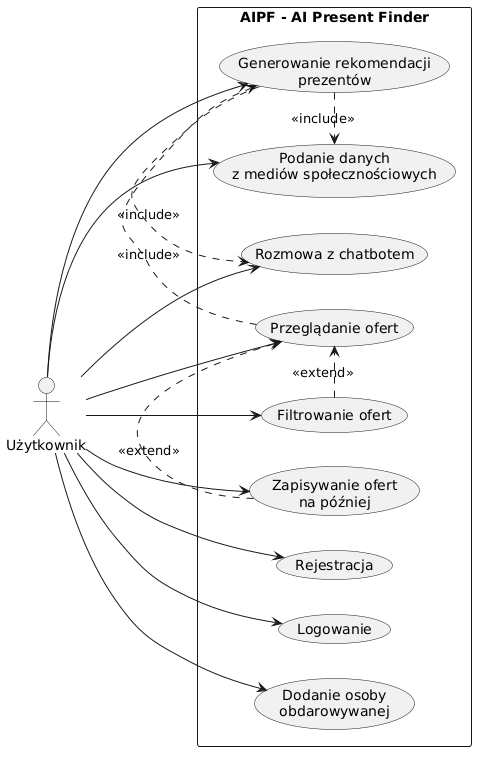
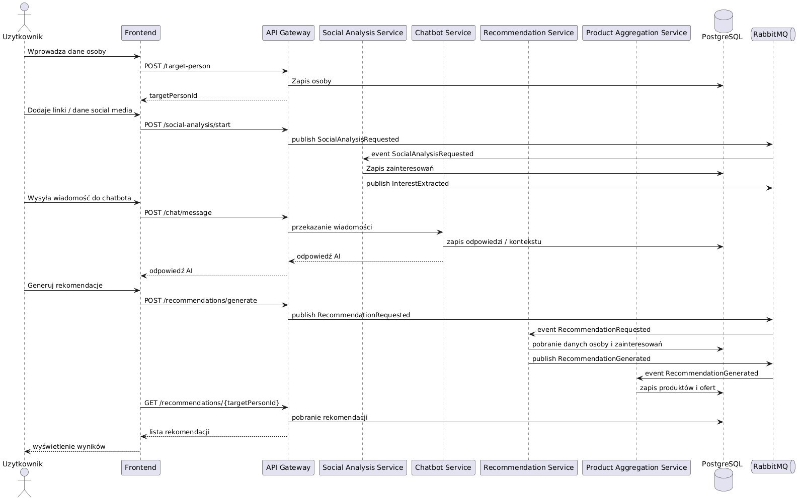
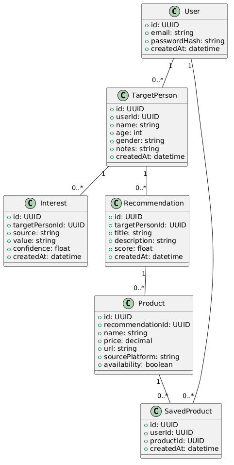
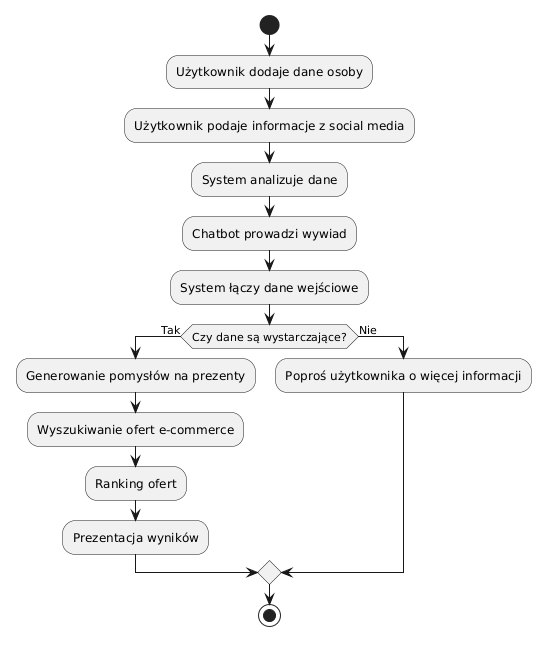
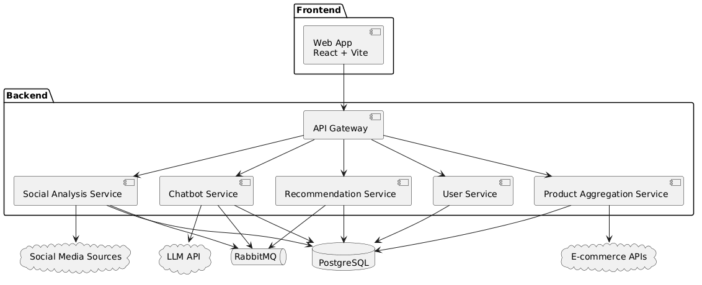
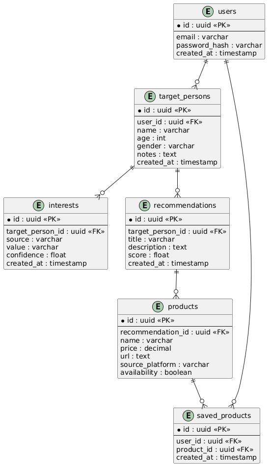

# 📄 AIPF — AI Present Finder

## Technical Design Document (TDD)

---

# 1. Wprowadzenie

## 1.1 Cel dokumentu

Celem dokumentu jest dostarczenie kompletnej specyfikacji technicznej systemu AIPF, umożliwiającej jego implementację bez konieczności podejmowania niejawnych decyzji projektowych.

## 1.2 Zakres systemu

System umożliwia:

- analizę danych o osobie (social media + input użytkownika)
- generowanie rekomendacji prezentów
- wyszukiwanie konkretnych ofert e-commerce
- interakcję przez chatbot

---

# 2. Architektura systemu

## 2.1 Styl architektoniczny

- Microservices
- Event-driven architecture
- CQRS

## 2.2 Komunikacja

- RabbitMQ (asynchroniczna)
- REST API (synchroniczna)

## 2.3 Główne komponenty

### Frontend

- React + Vite
- komunikacja: REST API

### Backend (mikroserwisy)

1. API Gateway
2. User Service
3. Social Analysis Service
4. Chatbot Service
5. Recommendation Service
6. Product Aggregation Service
7. Notification Service

---

# 3. Stack technologiczny

## Backend

- Node.js
- NestJS
- PostgreSQL
- RabbitMQ

## Frontend

- React
- Vite
- TypeScript

## DevOps

- Docker
- Docker Compose
- Github Actions
- Coolify

---

# 4. Model danych

## 4.1 Encje

### User

```json
{
  "id": "uuid",
  "email": "string",
  "createdAt": "timestamp"
}
```

### TargetPerson

```json
{
  "id": "uuid",
  "userId": "uuid",
  "name": "string",
  "age": "number",
  "gender": "string",
  "notes": "string"
}
```

### Interest

```json
{
  "id": "uuid",
  "targetPersonId": "uuid",
  "source": "social|chat",
  "value": "string",
  "confidence": "float"
}
```

### Recommendation

```json
{
  "id": "uuid",
  "targetPersonId": "uuid",
  "title": "string",
  "score": "float",
  "createdAt": "timestamp"
}
```

### Product

```json
{
  "id": "uuid",
  "recommendationId": "uuid",
  "name": "string",
  "price": "float",
  "url": "string",
  "source": "allegro|amazon|ebay"
}
```

---

# 5. API (REST)

## 5.1 Auth

### POST /auth/register

Request:

```json
{
  "email": "string",
  "password": "string"
}
```

### POST /auth/login

Response:

```json
{
  "token": "jwt"
}
```

---

## 5.2 Target Person

### POST /target-person

Tworzenie osoby

### GET /target-person/:id

Pobranie danych

---

## 5.3 Chatbot

### POST /chat/message

```json
{
  "targetPersonId": "uuid",
  "message": "string"
}
```

Response:

```json
{
  "reply": "string"
}
```

---

## 5.4 Recommendations

### POST /recommendations/generate

Trigger generowania

### GET /recommendations/:targetPersonId

---

## 5.5 Products

### GET /products/:recommendationId

---

# 6. Eventy (RabbitMQ)

## 6.1 InterestExtracted

```json
{
  "targetPersonId": "uuid",
  "interests": ["string"]
}
```

## 6.2 ChatCompleted

```json
{
  "targetPersonId": "uuid"
}
```

## 6.3 RecommendationGenerated

```json
{
  "targetPersonId": "uuid",
  "recommendationIds": ["uuid"]
}
```

---

# 7. Logika biznesowa

## 7.1 Flow generowania rekomendacji

1. user tworzy TargetPerson
2. SocialAnalysisService analizuje dane
3. Chatbot zbiera dodatkowe dane
4. powstaje lista Interest
5. RecommendationService generuje propozycje
6. ProductService wyszukuje produkty

---

## 7.2 Algorytm rekomendacji (MVP)

**Input:**

- interests[]
- demographic data

**Proces:**

- mapowanie interest → kategorie produktów
- scoring (TF-IDF / embedding similarity)
- ranking

**Output:**

- lista rekomendacji

---

# 8. Integracje zewnętrzne

## 8.1 Social Media

- public APIs (jeśli dostępne)
- scraping (fallback)

## 8.2 E-commerce

- Allegro API
- Amazon API
- eBay API

---

# 9. Bezpieczeństwo

- JWT auth
- hasła: bcrypt
- rate limiting
- walidacja inputu (class-validator)

---

# 10. Struktura repo

```
/apps
  /frontend
  /api-gateway
  /services
    /user
    /chatbot
    /recommendation
    /product
    /social-analysis

/libs
  /shared
```

---

# 11. CI/CD

Github Actions:

- build
- test
- docker build
- deploy

---

# 12. Deployment

- Docker containers
- orchestracja: Coolify

---

# 13. Testowanie

- unit tests (Jest)
- integration tests
- e2e tests

---

# 14. Monitoring

- logi: Winston
- metryki: Prometheus (opcjonalnie)

---

# 15. Ryzyka

- brak stabilnych API social media
- jakość danych wejściowych
- latency AI

---

# 16. MVP Scope

W MVP:

- chatbot (prosty)
- manual input zamiast social media (fallback)
- 1 platforma e-commerce

---

# 17. Rozszerzenia (Future)

- lepszy model AI (embeddings)
- system feedback loop
- personalizacja user-level

---

# 18. Wymagania funkcjonalne (Use Cases)

## UC1 – Rejestracja użytkownika

- Aktor: Użytkownik
- Opis: Użytkownik tworzy konto
- Wejście: email, hasło
- Wyjście: konto użytkownika

## UC2 – Dodanie osoby

- Aktor: Użytkownik
- Opis: Dodanie osoby obdarowywanej
- Wyjście: TargetPerson

## UC3 – Generowanie rekomendacji

- Aktor: Użytkownik
- Warunek: istnieją dane + zainteresowania
- Wyjście: lista rekomendacji + produkty

## UC4 – Chatbot

- Aktor: Użytkownik
- Opis: zbieranie informacji przez AI

---

# 19. Wymagania niefunkcjonalne (konkretne)

- Czas odpowiedzi API: < 2s
- Maksymalny czas generacji rekomendacji: < 10s
- Obsługa min. 1000 użytkowników równocześnie
- Autoryzacja: JWT
- Hasła: bcrypt (min. 10 salt rounds)
- API rate limit: 100 req/min/user

---

# 20. Kontrakty API (dokładne)

## POST /target-person

Request:

```json
{
  "name": "string",
  "age": 25,
  "gender": "male",
  "notes": "string"
}
```

Response:

```json
{
  "id": "uuid"
}
```

---

## POST /recommendations/generate

Response:

```json
{
  "status": "started"
}
```

---

## GET /recommendations/:targetPersonId

Response:

```json
[
  {
    "id": "uuid",
    "title": "string",
    "score": 0.85
  }
]
```

---

# 21. Schemat bazy danych (PostgreSQL)

```sql
CREATE TABLE users (
  id UUID PRIMARY KEY,
  email TEXT UNIQUE NOT NULL,
  password_hash TEXT NOT NULL,
  created_at TIMESTAMP
);

CREATE TABLE target_persons (
  id UUID PRIMARY KEY,
  user_id UUID REFERENCES users(id),
  name TEXT,
  age INT,
  gender TEXT,
  notes TEXT
);

CREATE TABLE interests (
  id UUID PRIMARY KEY,
  target_person_id UUID REFERENCES target_persons(id),
  source TEXT,
  value TEXT,
  confidence FLOAT
);

CREATE TABLE recommendations (
  id UUID PRIMARY KEY,
  target_person_id UUID REFERENCES target_persons(id),
  title TEXT,
  score FLOAT
);

CREATE TABLE products (
  id UUID PRIMARY KEY,
  recommendation_id UUID REFERENCES recommendations(id),
  name TEXT,
  price FLOAT,
  url TEXT,
  source TEXT
);
```

---

# 22. Flow systemu (end-to-end)

1. Użytkownik dodaje osobę
2. System analizuje dane (social + chatbot)
3. Tworzone są Interest
4. System publikuje event RecommendationRequested
5. RecommendationService generuje dane
6. ProductService pobiera produkty
7. Wyniki trafiają do bazy
8. Frontend pobiera i wyświetla dane

---

# 23. Podział na mikroserwisy (odpowiedzialności)

## User Service

- auth
- zarządzanie użytkownikami

## Social Analysis Service

- analiza danych social media
- ekstrakcja zainteresowań

## Chatbot Service

- komunikacja z LLM
- zbieranie danych

## Recommendation Service

- generowanie rekomendacji
- scoring

## Product Service

- integracja z API e-commerce
- agregacja produktów

---

# 24. Konwencje i zasady implementacyjne

- Każdy serwis = osobny projekt NestJS
- Komunikacja async przez RabbitMQ (events)
- API Gateway = jedyny punkt wejścia
- DTO + walidacja (class-validator)
- logowanie: Winston
- błędy: standard HTTP + error codes

---

# 25. OpenAPI (szkic)

```yaml
openapi: 3.0.0
info:
  title: AIPF API
  version: 1.0.0

paths:
  /target-person:
    post:
      summary: Create target person
      responses:
        '200':
          description: OK

  /recommendations/{id}:
    get:
      summary: Get recommendations
      parameters:
        - in: path
          name: id
          required: true
          schema:
            type: string
```

# 26. Diagramy UML

## 26.1 Diagram przypadków użycia



## 26.2 Diagram sekwencji



## 26.3 Diagram klas



## 26.4 Diagram aktywności



## 26.5 Diagram komponentów



## 26.6 Diagram ERD (baza danych)


